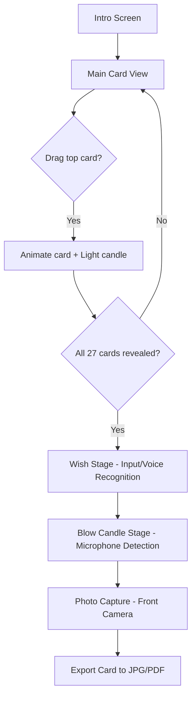

# Wishing Puzzle — Interactive Birthday Card PRD

## 1. Project Overview
An interactive web-based birthday card that combines emotional storytelling, puzzle-like engagement, and personalized output. The recipient (girlfriend) interacts with 27 stacked mini cards, each containing a heartfelt message. Each action triggers visual and auditory feedback, culminating in a unique digital card that includes wishes, a photo, and animations.

---

## 2. Objectives
- Create an emotionally immersive digital experience for a birthday celebration.
- Allow the recipient to interactively reveal messages and visually complete a symbolic task (lighting candles).
- Generate a personalized keepsake (JPG/PDF) as a memory artifact.

---

## 3. Target Platform & Tech Stack
- **Platform**: Web (desktop-focused, responsive layout)
- **Rendering**: HTML5 Canvas (p5.js)
- **Animation**: GSAP or p5 built-in animation
- **Audio**: Web Audio API
- **Voice Input**: Web Speech API (SpeechRecognition)
- **Camera Input**: getUserMedia (front camera capture)
- **Export**: html2canvas + jsPDF
- **Build Tool**: Vite (modular project setup)

---

## 4. Core Experience Flow

### Flowchart

---

## 5. Experience Breakdown

### 5.1 Intro Screen
**Purpose:** Set the tone and invite engagement.
- Background music (soft piano / lo-fi loop)
- Animation: Fade-in of card background and floating text.
- CTA button: "開始 / Begin"

### 5.2 Main Card View
**Left side**: Transparent photo background (couple photo).
**Right side**: Birthday cake with 27 unlit candles.
**Bottom**: Stack of 27 mini cards.

Interaction Rules:
- Only the **top card** is draggable.
- Dragging out a card triggers:  
  → Candle lighting animation  
  → Soft 'pop' sound effect  
  → Card placed freely with snap-to-grid positioning.
- Progress display: "Candles lit: X / 27".

### 5.3 Wish Stage
**Trigger:** After 27th card revealed.
- Three input fields: “Wish for yourself”, “Wish for us”, “Wish for the future”.
- Option for speech-to-text input.
- Wishes appear as stylized text labels around the cake.

### 5.4 Blow Candle Stage
**Trigger:** Clicking "Make a wish" button.
- Uses microphone volume detection to simulate blowing.
- Fire flicker + extinguish animation.
- Fallback: Manual 'Blow' button.

### 5.5 Photo Capture Stage
**Trigger:** All candles extinguished.
- Front camera activation (getUserMedia).
- Countdown overlay (3, 2, 1).
- Captured photo auto-placed on left half of card.
- Subtle vignette + timestamp: “2025.11.xx – Your Wish Day”.

### 5.6 Export Stage
**Trigger:** Capture complete.
- Combine layers (background + text + cards + photo + wishes).
- Generate JPG and PDF for download.
- Closing animation: "Saved to your memories 💖".

---

## 6. Functional Specifications

| Module | Description | Tech/Implementation |
|---------|--------------|--------------------|
| **CardStack** | Controls 27-card stack interactions | Canvas events + drag logic |
| **CandleSystem** | Manages 27 candle states + animations | drawFlame(), extinguish() via p5.js |
| **WishPanel** | Handles text/voice input for wishes | Web Speech API + DOM overlay |
| **BlowDetector** | Detects microphone input volume | Web Audio API |
| **PhotoCapture** | Captures image via webcam | getUserMedia, canvas drawImage() |
| **Exporter** | Combines and saves final card | html2canvas, jsPDF |
| **SoundManager** | Controls music & SFX | Web Audio Context |
| **StateManager** | Tracks game state flow | JS State machine pattern |

---

## 7. Design Guidelines

| Element | Guideline |
|----------|-----------|
| Color Palette | Warm beige, blush pink, soft brown (earth tones) |
| Font | Handwritten-style (Quicksand / Noto Sans Hand) |
| Layout | Split-screen: left (photo/cards) / right (cake/wishes) |
| Card Design | Uniform size, subtle paper texture, small corner icons for variation |
| Animation | Soft easing, no abrupt transitions |

---

## 8. Non-Functional Requirements
- **Performance**: Maintain 60 FPS for drag animation.
- **Export Quality**: Minimum 1920×1080, scalable to A4 300 DPI.
- **Privacy**: Camera/mic permissions requested with clear messaging.
- **Offline Support**: Optional cache (using service worker) for local replay.

---

## 9. Future Enhancements
- Multiple themes (e.g., sky, forest, ocean)
- Replay mode to reorder or revisit cards.
- Audio narration for each card (pre-recorded voice message).
- Cloud save for generated cards (Firebase or Supabase backend).

---

## 10. Milestones & Timeline

| Phase | Task | Deliverable | Duration |
|--------|------|--------------|-----------|
| P1 | Canvas Layout + Card Stack Prototype | Draggable cards + lit candles | 1 week |
| P2 | Animation Polish | Candle effects, easing | 1 week |
| P3 | Voice & Mic Integration | Wish + blow detection | 1 week |
| P4 | Photo Capture + Export | Save as JPG/PDF | 1 week |
| P5 | Final UX Pass | Music, polish, accessibility | 1 week |

Total: **5 weeks** (MVP to completion)

---

## 11. Success Metrics
- 100% completion rate for all 27-card interactions.
- Smooth performance (no dropped frames).
- Successful JPG/PDF generation rate >95%.
- Recipient emotional response (qualitative feedback measure).

